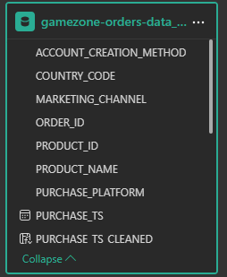

# **Power BI E-commerce Analysis: Growth, Risk, & Operations**

This repository contains the full analysis and Power BI report for a global e-commerce company. The project transforms a raw dataset into a 4-page executive-level report, identifies a catastrophic data bug, and presents a clear, data-driven story with actionable recommendations.

## **1. Project Background & Overview**

"Gamezone Electronics" (a fictional company) is a global e-commerce entity founded in 2018 that sells popular electronic products (both new and refurbished) via its website and mobile app. They have a variety of marketing channels they use to get their customers. Despite significant growth, the company's vast data on sales, marketing, and operations has been historically underutilized.

This project's goal is to analyze and synthesize this data (of 20,000 records) to uncover critical insights that will improve commercial success. This project is structured as a real-world business deliverable, written from the perspective of a Data Analyst at the company, and designed to provide actionable business value.

The analysis is focused on four key areas:

**Executive-Level Sales Trends**: How is the business performing at a high level?

**Business Overview**: Where is revenue concentrated (geographically, by product, and by channel)?

**Platform & Acquisition**: How do our platforms (Website vs. Mobile) perform, and what is the financial impact?

**Product & Operations**: How do our products perform, and are there any systemic risks in our supply chain?

## 2. Data Structure & Methodology

The analysis was performed in Excel and Power BI using DAX for all calculated measures. The dataset (provided as a single source) was modeled into a relational schema within Power BI to simulate a real-world data structure of joined tables (Orders, Users, Products).

Key data columns analyzed include:

* *USER_ID, ORDER_ID*

* *PURCHASE_TS_cleaned, SHIP_TS (See Caveats section)*

* *PRODUCT_NAME_cleaned, PRODUCT_ID*

* *USD_PRICE*

* *PURCHASE_PLATFORM (Website, Mobile)*

* *MARKETING_CHANNEL (Direct, Social, etc.)*

* *COUNTRY_CODE, Regions*

## **3. Executive Summary**

This analysis of E-list Electronics' data reveals a story of two-halves.

While the company experienced **explosive, profitable growth in 2020-2021** (driven by a $283 AOV), this success is dangerously concentrated in North America and on the Desktop platform (which has a 4x higher AOV than Mobile).

Most critically, all positive momentum is being undermined by a **catastrophic, systemic 75-DAY average shipping time**. This operational failure—uncovered after fixing a critical ETL bug—is an existential threat to brand loyalty.

This report recommends an "all-hands" crisis-management approach to fix operations, followed by a "protect-then-grow" strategy.

## 4. Insights Deep Dive: The 4-Page Story

The full report is structured as a 4-part narrative, guiding stakeholders from the "good news" to the "critical crisis."

**Insight 1: (Page 1) We Hit a New "Gear" of Profitable Growth**

The business is not just growing; it's selling better. In early 2020, both Revenue and, more importantly, Average Order Value (AOV) spiked and established a new, higher baseline (from ~$230 to ~$300+). This proves we are a high-value business.

**Insight 2: (Page 2) Our Success is Built on Concentration**

Our growth, while impressive, is not diversified. This is our greatest strength and our biggest risk.

Geographic: We are overwhelmingly a North American-centric business.

Product: We have clear "Value" (27in Monitor) and "Volume" (Nintendo Switch) champions.

Channel: We are a single-engine company. Over 85% of revenue comes from 'Direct' traffic, signaling brand strength but a critical dependency.

**Insight 3: (Page 3) The $231 AOV Gap**

We are a one-platform company. The data reveals a massive $231 AOV gap between our "High-Intent" Desktop shoppers ($305 AOV) and our "Quick-Task" Mobile shoppers ($74 AOV). With 95% of revenue tied to the website, our mobile app is a "dead-weight" asset and our single biggest growth opportunity.

**Insight 4: (Page 4) The 75-Day Shipping Crisis**

This is the climax of the story. Our product mix is healthy (clear Value/Volume drivers), but none of it matters. After fixing a major data bug, the analysis revealed a systemic, 75-day average shipping time.

This is not isolated to one product; it is an operational failure across our entire catalog. This 2.5-month delay is an existential threat that is actively destroying brand loyalty and erasing all other successes.

****5. Actionable Recommendations****

Based on these findings, I present a prioritized, three-phase action plan:

* Priority

* Phase

* Recommendation

### **Actionable Steps**

**1 Crisis Management (Triage)**

* Launch "Logistics War Room"

  **Actionable Steps:** Task Operations with a 7-day audit to find the PURCHASE_TS to SHIP_TS bottleneck.

* Proactive Customer Damage Control

  **Actionable Steps:** Launch a mass-email campaign to all waiting customers. Empower Customer Service with retention offers.

* Freeze All Demand Generation

**Actionable Steps:** Stop ALL marketing spend. Add "Sold Out" banners. We must stop taking new, unfulfillable orders.

  **4 Protect the Core (Sustain)**

* Implement "Volume-to-Value"

  **Actionable Steps:** Create smart bundles and email campaigns to cross-sell 'Value' products (monitors) to 'Volume' buyers (Switch).
  

**5 Protect the Core (Sustain)**

* Protect the 'Direct' Channel

  **Actionable Steps:** Re-allocate frozen marketing spend to a "Loyalty Program" to protect our 85% 'Direct' traffic base.
  

**6 Future Growth (Grow)**

* Launch "Mobile Friction" Audit

  **Actionable Steps:** Task the UX team with a 2-week sprint to fix mobile checkout (Apple/Google Pay, reduce clicks) to target the $231 AOV gap.
  

**6. Caveats & Assumptions**

This section demonstrates a practical understanding of real-world data challenges.

Critical Data Integrity: The most significant finding of this project was a major ETL error where the PURCHASE_TS and SHIP_TS columns were inverted in the source data. The 75-day shipping crisis was only uncovered after creating new, corrected columns in Power BI (DAX) to swap the values. This highlights the risk of "clean"-looking data.

External Factors: The 2020-2021 growth spike is correlated with, but not definitively caused by, global pandemic-era e-commerce trends.

Data Granularity: The bottleneck analysis is limited to the PURCHASE_TS and SHIP_TS timestamps. A deeper, future analysis would require warehouse-level data (e.g., order_processed_ts, label_created_ts) to pinpoint the exact failure point in the 75-day gap.
